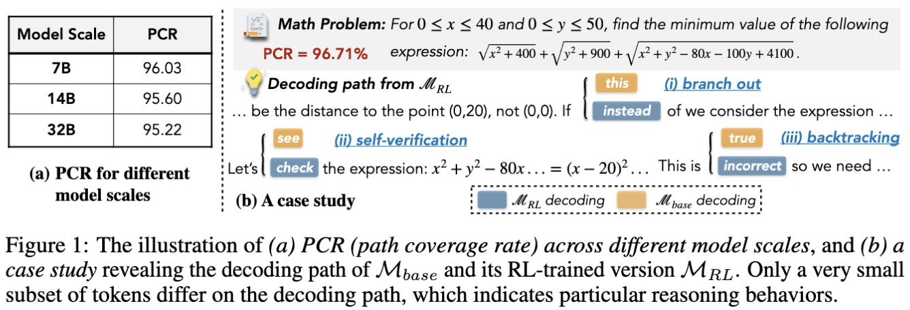
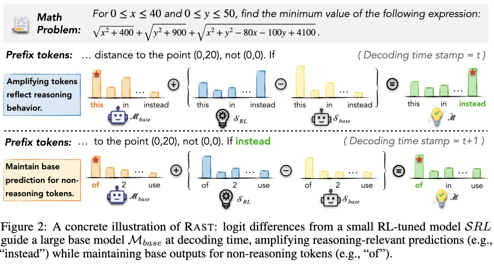

# 🧠 Reasoning Activation in LLMs via Small Model Transfer

<p align="center">
  <a href="https://ozyyshr.github.io/RAST/"></a>
  <a href="https://arxiv.org"></a>
</p>

🖋 **Authors:** [Siru Ouyang](https://ozyyshr.github.io/), [Xinyu Zhu](https://zhuxinyu.top/), [Zilin Xiao](https://zilin.me/), [Minhao Jiang](https://minhaoj2.github.io/), [Yu Meng](https://yumeng5.github.io/), [Jiawei Han](https://hanj.cs.illinois.edu/)


This repository contains the codebase and evaluation pipeline for our paper: **Reasoning Activation in LLMs via Small Model Transfer**. We propose a decoding-time method, **RAST**, that activates reasoning capabilities in large language models by transferring logit-level adjustments from smaller RL-tuned models.

## 🚀 Overview

Large Language Models (LLMs) tuned with RL are powerful reasoning capabilities. It is increasingly believed that RL does not endow LLMs with fundamentally new knowledge, but to elicit and amplify reasoning behaviours already present within base models. Specifically, we found that RL activates latent reasoning capabilities in LLMs not by globaly altering the entire output distribution, but by selectively adjusting the probabilities of a small subset of tokens that reflect reasoning behaviours.

<p align="center">
    
</p>

Instead of directly fine-tuning large models with reinforcement learning (RL), our method applies reasoning corrections derived from small-scale RL-tuned models to the output logits of larger models during inference—yielding reasoning performance gains without retraining.

<p align="center">
    
</p>

---

## 📂 Directory Structure

- `analysis/` – Scripts for result analysis and visualization.
- `datasets/` – Benchmark datasets used in our experiments.
- `modeling/` – Direct implementation using Huggingface (slow but intuitive).
- `scripts/` – Auxiliary scripts for launching experiments.
- `simplerl_math_eval/` – Evaluation tools for math reasoning datasets.
- `environment.yaml` – Conda environment file for reproducibility.
- `requirements.txt` – Python package dependencies.
- `utils.py` – Utility functions used throughout the codebase.
- `vllm` - Core implementation that implements RAST with vLLM framework for faster inference. **This** is the key implementation of RAST.

---

## 🔨 Usage

### 1. Setup Environment

```bash
conda env create -f environment.yaml
conda activate reasoners
```

### 2. Install vllm in editable mode to apply the changes

```bash
cd vllm
pip install -e .
```
Note that this step requires vllm==0.6.3, as specified in requirements.txt

### 3. Run Inference

Take Olympiad Bench as an example, the inference scripts is shown in the folloiwng:

```bash
cd vllm
export CUDA_VISIBLE_DEVICES=1,2,3,4

python tests/RAST_decode/run.py \
    --dataset Olympiad \
    --base_model Qwen/Qwen2.5-14B \
    --positive_model hkust-nlp/Qwen-2.5-1.5B-SimpleRL-Zoo \
    --negative_model Qwen/Qwen2.5-1.5B \
    --tensor_parallel_size 4 \
    --gpu_memory_utilization 0.6 \
    --cd_decoding_alpha 1.0 \
    --decoding_temperature 1.0 \
    --num_runs 32
```

### 4. Evaluation

We will using the eval system inside the `simplelr_math_eval` folder.

```bash
cd simplelr_math_eval
```

For example, suppose we have the results in `3. run inference` for Olympiad Bench under dir `results/OlympiadBench`, the eval script will be:

```bash
python math_eval_pred.py \
    --data_names olympiadbench \
    --k 32 \
    --num_questions 675 \
    --evaluation_mode pass \
    --res_dir results/OlympiadBench
```

The evaluation mode includes `average`, `pass (pass@k)`, and `majority (majority@k)`.

## Citation